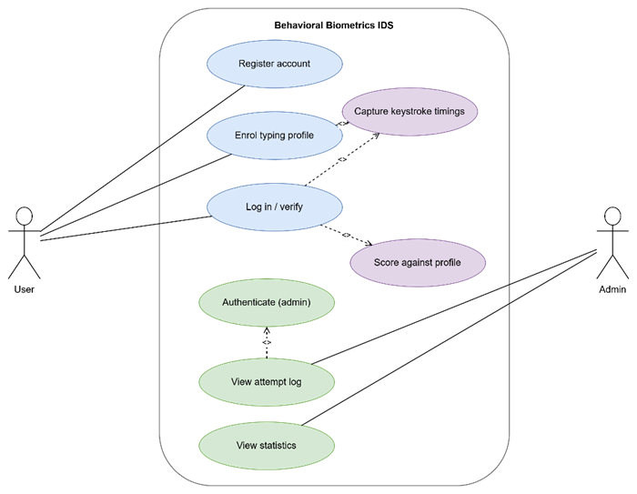
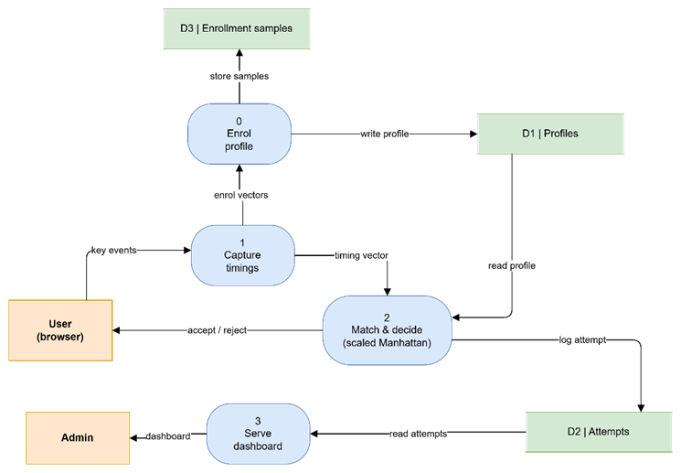
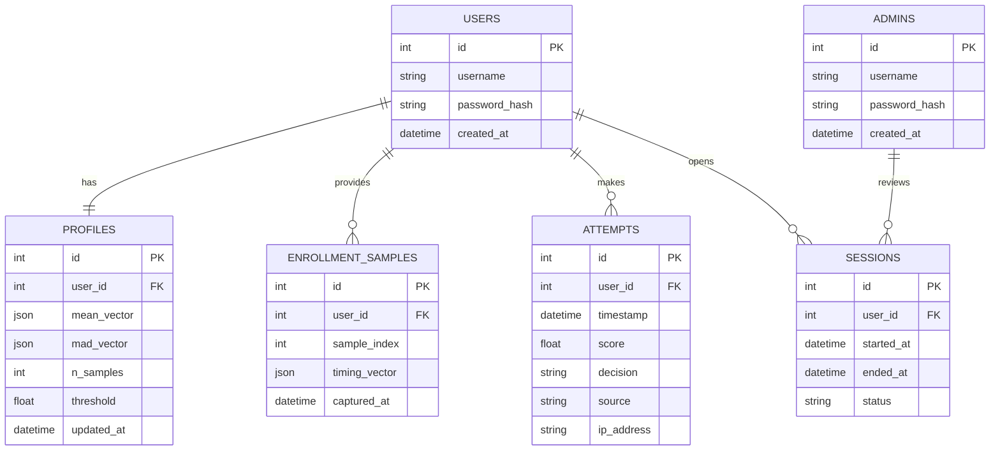
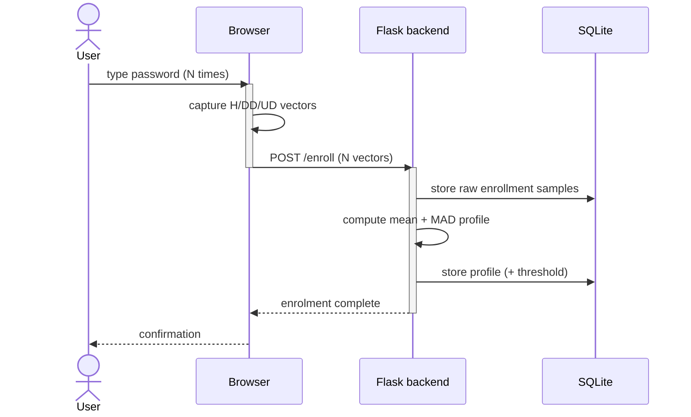
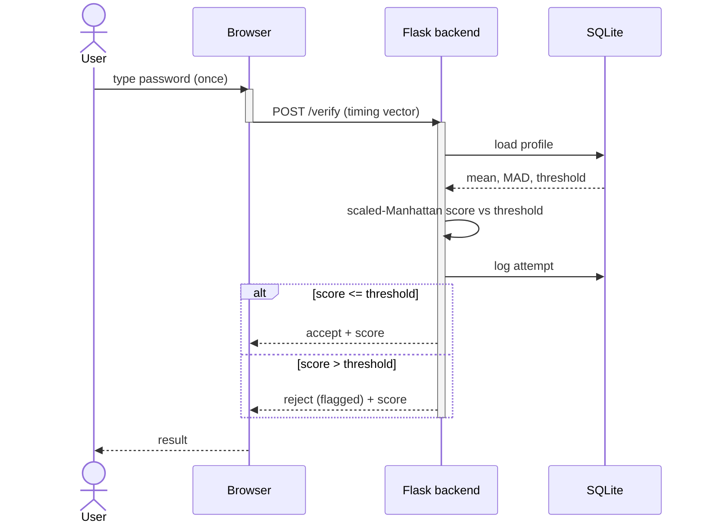
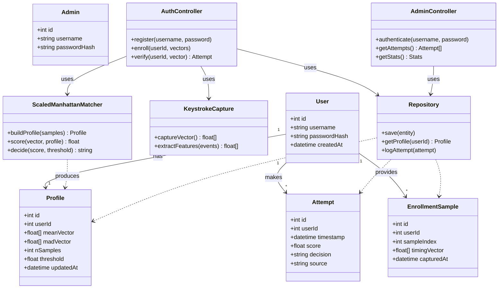

# Behavioral Biometrics-Based Intrusion Detection

*A keystroke-dynamics authentication system that detects intruders by how a user types their password — not just whether the password is correct.*

### Project Report — Chapters 1–4

> In-text citations follow APA 7th edition; page numbers are given only for direct figures, statistics, or quotations. Mermaid diagrams render inline; other figures are referenced from `figures/`.

---

## Chapter 1: Introduction

### 1.1 Problem Statement

Most systems still authenticate users with passwords, PINs, or patterns. The structural flaw of this knowledge-based model is that it verifies the *credential*, not the *person*: anyone who obtains the secret is granted full access (Papaioannou et al., 2023). A shared secret is also the easiest factor to compromise, since an attacker only has to learn or guess it (Maharrey, 2010).

This weakness is not theoretical. Weak or stolen credentials feature in 81% of all data breaches, and 69% of organisations report attempted data theft (Infosys, 2022). The average breach now costs around $4.24 million per incident — roughly $161 for every lost record (Jorion & Freund, 2023, pp. 1–2). Passwords fail for predictable human reasons: people choose short, guessable secrets, reuse them across services, and write them down, undermining the secrecy the scheme depends on. They are exposed to dictionary and brute-force attacks as well as to keyloggers, shoulder-surfing, and social engineering (Vaithyasubramanian et al., 2016). Above all, a password is a one-shot check performed only at login; it offers no protection once a session is active (Papaioannou et al., 2023).

The result is a specific, unaddressed threat: an impostor who already knows the correct password. Conventional authentication has no way to detect this person, because the typed credential is valid. This project targets exactly that gap.

### 1.2 Aim and Objectives

The aim is to design and implement an intrusion detection system that authenticates users by their keystroke dynamics, validated offline on a public benchmark and demonstrated live in the browser.

The objectives are to:
1. Acquire and prepare the CMU Keystroke Dynamics Benchmark for analysis.
2. Implement a scaled-Manhattan anomaly detector and evaluate it offline using EER, a confusion matrix, and an ROC curve.
3. Build a Flask backend that computes the match decision, stores enrolment profiles in SQLite, and logs every attempt.
4. Implement a browser keystroke-capture module and a live enrol-then-verify demonstration.
5. Provide an administrative dashboard showing logged attempts and basic statistics.
6. Keep the offline benchmark results and the live demonstration strictly separate in reporting.

### 1.3 Project Scope

The project covers fixed-text keystroke authentication for a single known password, an offline evaluation on a public benchmark, a live browser enrol/verify demonstration, and a backend that owns the matching decision, stores profiles persistently, and logs attempts.

It does not cover free-text or continuous session monitoring, other behavioral modalities such as mouse or gait dynamics, the collection of an original dataset from human participants, or production-grade deployment. A deliberate boundary is kept between the two evaluation contexts: the offline benchmark and the live demo run the same algorithm on different data, and their numbers are never mixed (see Section 3.2).

### 1.4 Contribution

The contribution is to connect a benchmark-grade keystroke detector to a working, interactive authentication layer. Most existing work reports strong offline error rates but stops short of a usable system that enrols a user, stores a profile, and makes live decisions with logging. This project closes that gap while handling the timing-precision difference between a research benchmark and an ordinary browser honestly, rather than conflating the two.

### 1.5 Report Outline

Chapter 2 reviews authentication, behavioral biometrics, keystroke dynamics, intrusion detection, and related work. Chapter 3 sets out the methodology. Chapter 4 covers system design and implementation, Chapter 5 presents results and evaluation, and Chapter 6 concludes and outlines future work.

---

## Chapter 2: Background & Literature Review

### 2.1 Authentication and the Three-Factor Model

Authentication factors fall into three categories (Maharrey, 2010):

- **Something you know** (knowledge): passwords, PINs, patterns.
- **Something you have** (ownership): tokens, smart cards, phones.
- **Something you are** (inherence): biometrics — either physiological (fingerprint, iris, face) or behavioral (keystroke dynamics, voice, gait).

Single-factor authentication verifies only the submitted credential and is the easiest factor to bypass. Two-factor authentication is stronger but is still defeated when both factors are compromised — a stolen password together with a stolen smart card, for example (Huang et al., 2011) — and one-time-passcode factors remain vulnerable to interception, while hardware tokens add cost and user friction (Papaioannou et al., 2023). This motivates an inherence factor that is bound to the user and verified without friction.

### 2.2 Behavioral Biometrics

Behavioral biometrics identify a person by patterns in their behavior rather than by static physical features, relying on dynamic actions such as typing rhythm, mouse movement, voice, and gait (Papaioannou et al., 2023). The principal modalities are:

- **Keystroke dynamics** — a user's typing rhythm.
- **Mouse dynamics** — movement trajectories, clicks, and drag-and-drop behavior.
- **Mobile/touch dynamics** — swipes, touch pressure, and device-handling captured via built-in sensors.

**Advantages.** Because they use standard input devices, behavioral biometrics require no special scanning hardware, and they can operate continuously in the background rather than only at login (Amin & Di Iorio, 2025; OneSpan, 2019). A user's precise rhythm is also difficult to replicate, steal, or share.

**Limitations.** Human behavior varies with fatigue, stress, and environment, producing occasional false rejections; behavioral traits are less permanent and accurate than physiological ones; continuous data collection raises privacy and compliance concerns; and the field lacks common standards (Papaioannou et al., 2023).

### 2.3 Keystroke Dynamics

#### 2.3.1 A Brief History

The idea originates in telegraphy, where operators recognised one another by their distinctive tapping rhythm, or "fist" (Ahmad et al., 2013). Formal computer-based study began with Forsen and colleagues in 1977, who asked whether users could be distinguished by how they typed their own names. The first major experiment followed in 1980, when Gaines and colleagues showed with seven typists that individual typing signatures existed and introduced the analysis of digraph latencies (Ahmad et al., 2013). Umphress and Williams (1985) then gave the approach further credibility. Through the 1980s and 1990s, research adopted neural networks and fuzzy logic and moved from static, login-only analysis toward continuous monitoring. The 2000s added variables such as keystroke pressure, and the field later expanded to mobile and touch devices. Most recently, large public datasets have shifted the state of the art toward deep learning (Shadman et al., 2023).

#### 2.3.2 Timing Features

Keystroke dynamics are built on three timing features (Amin & Di Iorio, 2025):

- **Hold time (H):** how long a single key is held — its release time minus its press time.
- **Down-Down (DD):** the interval between pressing one key and pressing the next.
- **Up-Down (UD):** the flight time, or interval between releasing one key and pressing the next.

#### 2.3.3 Fixed-Text vs Free-Text

In fixed-text systems the user types a predefined string during both enrolment and authentication; because the input is known, comparison is precise and simple to implement, though usability is limited and it usually acts as a secondary login factor. Free-text systems analyse general typing habits with no fixed input — harder to implement and noisier, but better suited to continuous authentication (Shadman et al., 2023). This project uses the fixed-text approach, which matches both the benchmark and the login use case.

### 2.4 Intrusion Detection Systems

#### 2.4.1 Detection Logic and Deployment

Intrusion detection systems are classified by detection logic and by deployment model (Abboud, 2026).

By detection logic:
- **Anomaly-based** detection learns a baseline of normal behavior and flags deviations, which lets it catch unknown attacks but makes it prone to false alarms.
- **Signature-based** detection matches activity against a database of known attack patterns, which is accurate for cataloged threats but blind to new ones.

By deployment:
- **Host-based (HIDS)** monitors a single endpoint in detail, at the cost of local overhead.
- **Network-based (NIDS)** observes traffic across many hosts for broader but shallower visibility.

This project is an anomaly-based, host-side approach: it learns a legitimate user's typing baseline and flags deviating logins.

#### 2.4.2 Behavioral Biometrics for Intrusion Detection

Behavioral biometrics enable intrusion detection without special hardware by analysing how a user interacts with an ordinary keyboard and mouse, captured passively in the background (Ahmed & Traore, 2005). By verifying who is operating the device rather than what actions are performed, the approach can catch an intruder who has bypassed the login and is carrying out otherwise authorised operations, and it is light enough to run in real time on existing systems (Tuama, 2026). In practice, an enrolment phase builds a Keystroke Dynamics Signature (KDS) from the user's timing features; during verification, new input is compared against the stored signature, and growing deviation lowers confidence in the user's identity, flagging a likely intrusion (Ahmed & Traore, 2005).

### 2.5 Detection Techniques and Algorithm Selection

Killourhy and Maxion (2009) provide the field's standard comparison, re-implementing fourteen anomaly detectors on one shared benchmark to remove the inconsistent evaluation conditions of earlier work. Their headline results are summarised below.

| Detector | Equal Error Rate | Zero-miss FA rate | EER rank |
|---|---|---|---|
| Scaled Manhattan | 9.6% | 0.601 | 1st |
| Nearest Neighbour (Mahalanobis) | 10.0% | 0.468 (best) | 2nd |
| SVM (one-class) | 10.2% | 0.504 | 4th |
| Mahalanobis | 11.0% | 0.482 | 5th |
| Manhattan (plain) | 15.3% | 0.843 | 8th |
| Euclidean | 17.1% | 0.875 | 10th |
| k-Means | 37.2% | 0.989 | 13th |

The authors conclude that the strongest detectors are those that scale the timing features, because hold times and key latencies have naturally different variability (Killourhy & Maxion, 2009). This is the decisive reason the project adopts the scaled-Manhattan detector as its primary method, retaining Nearest-Neighbour (Mahalanobis) as a secondary comparison. Plain Manhattan, which ranked only eighth, is avoided.

### 2.6 Review of Related Work

The table below summarises the most relevant prior studies; the project's design — fixed-text, anomaly-based, scaled-Manhattan on the CMU benchmark — is positioned directly against them.

| Work | Problem | Dataset | Method | Main result | Limitation |
|---|---|---|---|---|---|
| Killourhy & Maxion (2009) | No standardised detector comparison | CMU (51 users) | 14 anomaly detectors | Scaled Manhattan best (EER 9.6%) | Single dataset; far above access-control miss standard |
| Ahmed & Traore (2005) | IDS miss masqueraders who know valid sequences | 22 users, 9 weeks | Keystroke + mouse signatures | FNR 0.65%, FPR 1.31% | Needs large enrolment data |
| Amin & Di Iorio (2025) | Compare keystroke models | Aalto, Buffalo, others | GMM, Mahalanobis, Gunetti–Picardi | GMM lowest EER (~0.15) | Low permanence; degrades at scale |
| Wahab et al. (2025) | Effect of dataset breadth vs depth | Aalto, CMU, Clarkson II | Siamese neural network | EER 0.7% on CMU | Free-text under-trained; costly data |
| Nkenlifack et al. (2022) | Passwords easily acquired | CMU | Ensemble (bagging) | 95.65% accuracy | Sensitive to stress; hardware-dependent |
| Shishin (2025) | Post-login data unprotected if device hijacked | BB-MAS + mouse data | 8 ML models | RF 39.3% EER (keystroke) | Too high for primary authentication |
| Dehling et al. (2024) | Browser timestamp limits may break KD | Public KD datasets | Browser timestamp playback | Robust to ≤200 ms limits | Could not test below 100 µs |
| Tuama (2026) | Vanishing perimeter; user complacency | Synthetic MATLAB (40 sessions) | KNN (k=3), mouse features | 95% accuracy, MCC 1.00 | Synthetic data; overfitting risk |
| Infosys (2022) | Signature solutions lack behavior mapping | Keystroke/mouse/touch + logs | Behavioral-biometrics UEBA | Frictionless continuous auth | Compute- and data-intensive |
| OneSpan (2019) | Frictionless fraud defence for mobile banking | Population profiling | Passive behavioral biometrics | Transparent fraud detection | Not a standalone solution |

*(A fuller comparison table spanning roughly 30 works, including early studies — Gaines et al. 1980, Obaidat & Sadoun 1997, Bergadano et al. 2002, Araújo et al. 2005 — is available for the appendix.)*

### 2.7 Gaps and Justification

Three gaps emerge from this review. First, prior studies report strong offline error rates but rarely deliver an interactive system that enrols, stores, and decides live — which this project does. Second, simple scaled-distance detectors rival much heavier models (Killourhy & Maxion, 2009), so a scaled-Manhattan core is both defensible and light enough to run in a browser and a small backend. Third, moving a detector from a microsecond benchmark to a millisecond browser risks conflating two measurement regimes; reassuringly, keystroke algorithms are robust to reduced timing precision (Dehling et al., 2024), which the project relies on while keeping the two contexts separate.

---

## Chapter 3: Methodology

### 3.1 Introduction

This chapter sets out the research approach, the dataset, the algorithm, the development process, and the evaluation criteria. The defining choice is a single algorithm — scaled Manhattan — applied across two clearly separated contexts.

### 3.2 Research Methodology and Two-Mode Separation

The project follows an applied, experimental approach structured around the CRISP-DM lifecycle: understanding the problem, understanding and preparing the data, modelling with the scaled-Manhattan detector, evaluating with EER, ROC, and a confusion matrix, and deploying the same detector in a Flask backend and a live browser demonstration. System construction is iterative, with each component built and tested before integration.

The central methodological safeguard is two-mode separation, because timer precision differs by context. Research-grade collection uses hardware clocks accurate to ±200 microseconds (Killourhy & Maxion, 2009, p. 128), whereas browsers deliberately clamp the resolution of timing functions such as `performance.now()` and add jitter to resist side-channel attacks, leaving precision between roughly 5 microseconds and 1 millisecond (Dehling et al., 2024). The two modes are therefore never mixed:

| | Offline mode | Live demo mode |
|---|---|---|
| Data source | CMU benchmark | Typing captured in the browser |
| Timing precision | Microsecond (hardware) | Millisecond (browser events) |
| Purpose | Produce all reported metrics | Proof-of-concept demonstration |

This separation is defensible because keystroke algorithms remain robust under reduced precision: default browser limits have no relevant impact on performance, and even severe limits mainly raise the false-rejection rate while keeping the false-acceptance rate below about 0.3% (Dehling et al., 2024). The shared algorithm gives the report a coherent narrative; the separation prevents methodological conflation.

### 3.3 Development Stages

#### 3.3.1 Time Table

| Phase | Activities | Milestone |
|---|---|---|
| 1 | Requirements, scope, dataset selection | Dataset and method fixed |
| 2 | Data preparation and offline modelling | EER / ROC / confusion matrix produced |
| 3 | Flask backend: matcher, SQLite profiles, logging | Backend makes match decisions |
| 4 | Browser capture module and live demo | Working demonstration |
| 5 | Admin dashboard | Dashboard operational |
| 6 | Integration, testing, evaluation, report | Final submission |

#### 3.3.2 Gantt Chart

*Figure 3.1 — Gantt Chart of the six project phases.*

### 3.4 Data and Evaluation

#### 3.4.1 Dataset

The project uses the CMU Keystroke Dynamics Benchmark. It contains 51 subjects, each typing the fixed ten-character password `.tie5Roanl` 400 times across eight sessions, with at least a day between sessions to capture natural day-to-day variation (Killourhy & Maxion, 2009, p. 128). Each repetition is represented by its hold (H), down-down (DD), and up-down (UD) timing features. The dataset was chosen over original collection because it removes the overhead of building a collection system and its fixed-password, deep per-user structure suits the problem directly.

Following the benchmark protocol, for each subject in turn the first 200 repetitions train the genuine profile, while the remaining 200 genuine repetitions and the first five repetitions of every other subject (acting as impostors) form the test set; the procedure repeats for all 51 subjects (Killourhy & Maxion, 2009, p. 131). For the live demo, samples are captured fresh in the browser and used only for the demonstration.

#### 3.4.2 Evaluation Criteria

Performance is measured with three standard biometric metrics (Shadman et al., 2023):

- **Equal Error Rate (EER):** the operating point at which the false-acceptance and false-rejection rates are equal — a single headline figure, lower is better.
- **ROC curve:** plots the true-acceptance rate against the false-acceptance rate across thresholds.
- **Confusion matrix:** tabulates correct and incorrect classifications of genuine and impostor attempts.

The success criterion is that the scaled-Manhattan detector reproduces benchmark-consistent error rates of roughly 9–10% EER, confirming a correct implementation, with the Nearest-Neighbour comparison evaluated under the same protocol. The live demo is judged separately and qualitatively: whether enrolment, verification, the match decision, profile persistence, and attempt logging all function end to end.

### 3.5 Summary

The methodology is an applied, CRISP-DM-based process with iterative development, built around one scaled-Manhattan detector applied across two strictly separated contexts — a microsecond benchmark that produces all reported metrics and a millisecond browser demo that proves the concept live. The CMU dataset, its train/test protocol, and the EER, ROC, and confusion-matrix criteria were defined. Chapter 4 details the system that implements this methodology.

---

---

## Chapter 4: System Analysis & Design

### 4.1 Introduction

This chapter analyses and designs the system before implementation: the functional and non-functional requirements, followed by use case, data flow, entity-relationship, sequence, and class models.

### 4.2 Requirements Specifications

#### 4.2.1 Functional Requirements

1. **Registration** — a user creates an account.
2. **Enrolment** — capture N typing samples of the fixed password, store the raw samples, and build a per-user timing profile (feature means and mean absolute deviations).
3. **Verification** — compare a login attempt's timing vector against the stored profile and return an accept/reject decision.
4. **Profile & sample storage** — persist enrolment samples and profiles.
5. **Attempt logging** — record every login attempt (user, timestamp, score, decision, source).
6. **Admin authentication** — an admin logs in to the dashboard.
7. **Admin dashboard** — display logged attempts and summary statistics.
8. **Offline evaluation** — train and evaluate the detector on the CMU benchmark, producing EER, ROC, and confusion-matrix outputs.

#### 4.2.2 Non-Functional Requirements

1. **Security** — the verification decision is computed server-side; the browser never decides. Credentials are stored hashed.
2. **Performance** — verification latency is imperceptible at login (well under one second).
3. **Portability** — runs on a standard machine with no special hardware.
4. **Integrity** — offline benchmark data and live browser data are never mixed (marked by the `source` field).
5. **Usability** — the enrol/login flow is simple and gives clear feedback.
6. **Maintainability** — capture, decision, and storage are separated into distinct layers.

### 4.3 Use Case Diagram

Two actors — **User** (register, enrol, log in) and **Admin** (authenticate, view attempt log, view statistics). Enrolment and login both *include* keystroke capture; login also *includes* scoring against the profile.

*Figure 4.1 — Use Case Diagram.*

### 4.4 Data Flow Diagram

Modelled in Gane-Sarson notation with external entities (User, Admin), four processes (0 Enrol profile, 1 Capture timings, 2 Match & decide, 3 Serve dashboard), and three data stores (D1 Profiles, D2 Attempts, D3 Enrollment samples). The offline pipeline supplies the decision threshold only; its data never enters the live stores.

*Figure 4.2 — Level-1 Data Flow Diagram.*

### 4.5 Entity Relationship Diagram

The data model has six tables: users, admins, enrollment_samples, profiles, attempts, and sessions. A user has one profile, many enrolment samples, many attempts, and many sessions. Vectors are stored as JSON arrays; the `source` field on `attempts` preserves the two-mode separation at the data level.

*Figure 4.3 — Entity Relationship Diagram.*

### 4.6 Sequence Diagrams

**Enrolment** — the browser captures N timing vectors and posts them; the backend stores the raw samples, computes the mean/MAD profile and threshold, and persists the profile.

*Figure 4.4 — Enrolment Sequence Diagram.*

**Verification** — the browser posts one timing vector; the backend loads the profile, computes the scaled-Manhattan score against the threshold, logs the attempt, and returns accept or reject with the score.

*Figure 4.5 — Verification Sequence Diagram.*

### 4.7 Class Diagram

The design has five entity classes (User, Admin, EnrollmentSample, Profile, Attempt) and five service classes: **KeystrokeCapture** (derives H/DD/UD features from key events), **ScaledManhattanMatcher** (builds profiles, scores a vector, decides accept/reject), **AuthController** (register, enrol, verify), **AdminController** (authenticate, attempts, statistics), and **Repository** (persistence). Controllers depend on the matcher, capture, and repository; the matcher produces Profile objects.

*Figure 4.6 — Class Diagram.*

### 4.8 Summary

The system is specified through its functional and non-functional requirements and modelled with use case, data flow, ERD, sequence, and class diagrams. The design separates capture (browser), decision (Flask), and storage (SQLite), uses a six-table schema, and preserves the two-mode separation. Chapter 5 covers implementation and results.

---

## References

1. Abboud, S. M. (2026). Review of intrusion detection system architectures in IoT-WSN network. *Journal of Al-Qadisiyah for Computer Science and Mathematics, 18*(2), 39–49. https://doi.org/10.29304/jqcsm.2026.18.22605

2. Ahmad, N., Szymkowiak, A., & Campbell, P. A. (2013). Keystroke dynamics in the pre-touchscreen era. *Frontiers in Human Neuroscience.* PMCID: PMC3867681.

3. Ahmed, A. A. E., & Traore, I. (2005). Anomaly intrusion detection based on biometrics. In *Proceedings of the 2005 IEEE Workshop on Information Assurance and Security* (pp. 452–453). IEEE. (Note: A highly similar paper by the same authors is also included in the sources under the title "Detecting Computer Intrusions Using Behavioral Biometrics".)

4. Amin, S., & Di Iorio, C. (2025). A review of several keystroke dynamics methods. *arXiv preprint* arXiv:2502.16177v1.

5. Dehling, F., Koch, S., Lo Iacono, L., & Federrath, H. (2024). You are as you type: Investigating the influence of timestamp accuracy on the robustness of keystroke biometrics. *Preprint accepted for publication at IEEE TrustCom-2024.*

6. Huang, X., Xiang, Y., Chonka, A., Zhou, J., & Deng, R. H. (2011). A generic framework for three-factor authentication: Preserving security and privacy in distributed systems. *IEEE Transactions on Parallel and Distributed Systems, 22*(8), 1390–1396. https://doi.org/10.1109/TPDS.2010.206

7. Infosys. (2022). *Adopt behavioral biometrics and analytics for effective cybersecurity and fraud management* [White paper]. Infosys Limited.

8. Jorion, N., & Freund, J. (2023). The true cost of a data breach. *ISACA Journal, 1*, 1–7.

9. Killourhy, K. S., & Maxion, R. A. (2009). Comparing anomaly-detection algorithms for keystroke dynamics. In *Proceedings of the 39th Annual International Conference on Dependable Systems and Networks (DSN-2009)* (pp. 125–134). IEEE Computer Society Press. (Note: The companion dataset documentation is cited as: Killourhy, K. S., & Maxion, R. A. (2009). *Keystroke dynamics – benchmark data set.* Carnegie Mellon University. http://www.cs.cmu.edu/~keystroke)

10. Maharrey, B. (2010). *Authentication protocols, their issues and our solutions* (Technical Report Number CSSE10-06). Auburn University, Computer Science & Software Engineering.

11. Nkenlifack, M., Azanguezet Quimatio, B. M., & Yatio Njike, O. F. (2022). User authentication through keystroke dynamics based on ensemble learning approach. In *CARI 2022 – Colloque Africain sur la Recherche en Informatique et en Mathémathiques Appliquées.* HAL Open Science. https://hal.science/hal-03713677v1

12. OneSpan. (2019). *Behavioral biometrics: Frictionless security in the fight against fraud* [White paper]. OneSpan North America Inc.

13. Papaioannou, M., Essop, A., Mantas, G., Rodriguez, J., Panaousis, E., & Sucasas, V. (2023). *Behavioral biometrics for mobile user authentication: Benefits and limitations.*

14. Shadman, R., Wahab, A. A., Manno, M., Lukaszewski, M., Hou, D., & Hussain, F. (2023). *Keystroke dynamics: Concepts, techniques, and applications.*

15. Shishin, I. (2025). *Behavioral biometrics based authentication system using machine learning* [Bachelor's thesis, Tallinn University of Technology].

16. Tuama, S. O. (2026). Behavioral intrusion detection using KNN and mouse dynamics and session timing. *Journal of University of Babylon for Pure and Applied Sciences (JUBPAS), 34*(1), 37–48.

17. Vaithyasubramanian, S., Christy, A., & Saravanan, D. (2016). Access to network login by three-factor authentication for effective information security. *The Scientific World Journal, 2016*, 6105053. https://doi.org/10.1155/2016/6105053

18. Wahab, A. A., Hou, D., Cheng, N., Huntley, P., & Devlen, C. (2025). Impact of data breadth and depth on performance of siamese neural network model: Experiments with three keystroke dynamic datasets. *arXiv preprint* arXiv:2501.07600v1.
